# 🔥 Fire Evacuation Simulation — Project Report

> **Project Type:** Agent-Based Model (ABM) Simulation with Real-Time Web Dashboard  
> **Event:** Innofest  
> **Stack:** Python (Mesa ABM) · FastAPI · WebSocket · Next.js · TypeScript · Recharts  
> **Date:** March 2026

---

## Table of Contents

1. [Project Overview](#1-project-overview)
2. [System Architecture](#2-system-architecture)
3. [Backend — Simulation Engine](#3-backend--simulation-engine)
   - 3.1 [FireEvacuation Model](#31-fireevacuation-model)
   - 3.2 [Agent Types](#32-agent-types)
   - 3.3 [Human Agent Behaviour](#33-human-agent-behaviour)
   - 3.4 [Fire & Smoke Propagation](#34-fire--smoke-propagation)
   - 3.5 [Floorplan System](#35-floorplan-system)
4. [Backend — API Layer](#4-backend--api-layer)
5. [Frontend — Web Dashboard](#5-frontend--web-dashboard)
   - 5.1 [UI Layout](#51-ui-layout)
   - 5.2 [Component Breakdown](#52-component-breakdown)
   - 5.3 [WebSocket Hook](#53-websocket-hook)
6. [Data Flow](#6-data-flow)
7. [Key Algorithms](#7-key-algorithms)
8. [Simulation Parameters](#8-simulation-parameters)
9. [Statistics & Metrics](#9-statistics--metrics)
10. [Technology Stack Summary](#10-technology-stack-summary)
11. [Setup & Running](#11-setup--running)

---

## 1. Project Overview

This project is a **real-time, interactive fire evacuation simulation** built on **Agent-Based Modelling (ABM)** principles. It simulates how a group of people behave and attempt to escape from a building during a fire emergency.

### What it demonstrates
- How individual human behaviours (panic, collaboration, vision, speed) affect overall evacuation outcomes.
- How fire and smoke spread through a building over time.
- The impact of **collaboration** (verbal, physical, and morale support) between agents.
- Real-time visualisation of all agent states on the actual building floorplan.

### Why ABM?
Unlike traditional equation-based models, ABM lets each agent act **independently** with its own state, making emergent group behaviour (e.g., bottlenecks, cascading panic) observable naturally from the bottom up.

---

## 2. System Architecture

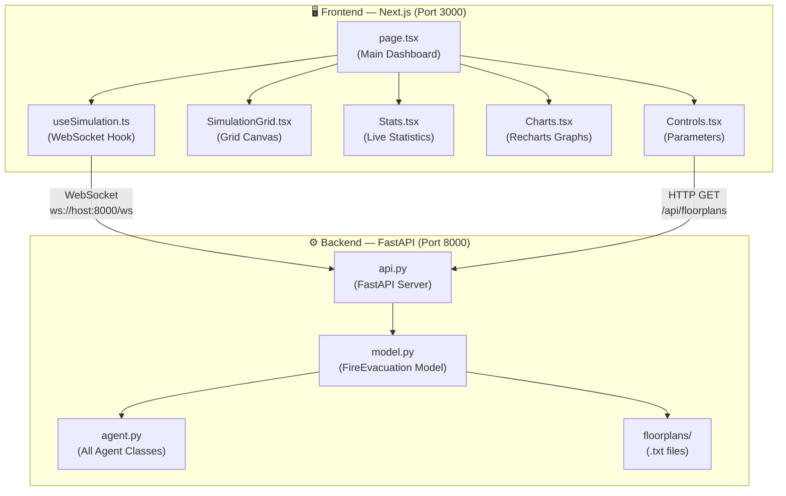

The system is split into two independent processes connected by a **persistent WebSocket connection**:

| Layer | Technology | Port | Purpose |
|---|---|---|---|
| Frontend | Next.js + TypeScript | 3000 | Interactive UI, grid rendering, charts |
| Backend | FastAPI + Python | 8000 | ABM simulation engine, state broadcasting |
| Transport | WebSocket | 8000/ws | Real-time bidirectional communication |
| Config API | HTTP REST | 8000/api | Fetching list of available floorplans |

---

## 3. Backend — Simulation Engine

The simulation core is located in `backend/fire_evacuation/` and is built on top of [Mesa](https://mesa.readthedocs.io/), a Python framework for Agent-Based Modelling.

### 3.1 FireEvacuation Model

**File:** `backend/fire_evacuation/model.py`

The `FireEvacuation` class is the top-level Mesa `Model`. It orchestrates everything:

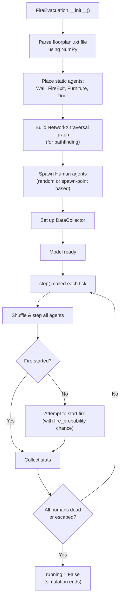

**Key responsibilities:**
- Loads and parses the ASCII floorplan into a `MultiGrid` (multiple agents can occupy same cell).
- Builds a `networkx.Graph` of all traversable tile connections for shortest-path calculations.
- Tracks `fire_exits`, `doors`, and `furniture` in dictionaries for fast lookup.
- Runs a `DataCollector` that logs statistics at each step.
- Calls `start_fire()` probabilistically until fire ignites.

**Model Parameters:**

| Parameter | Type | Default | Description |
|---|---|---|---|
| `floor_plan_file` | `str` | `floorplan_testing.txt` | Which floorplan to load |
| `human_count` | `int` | `10` | Number of human agents to spawn |
| `collaboration_percentage` | `float` | `50.0` | % of agents that will collaborate |
| `fire_probability` | `float` | `0.1` | Probability of fire starting each step |
| `visualise_vision` | `bool` | `False` | Show agent vision cones on grid |
| `random_spawn` | `bool` | `True` | Spawn agents at random tiles vs. spawn points |
| `save_plots` | `bool` | `False` | Save matplotlib charts at end of run |

---

### 3.2 Agent Types

All agents inherit from a common `FloorObject(Agent)` base class and are placed on the Mesa `MultiGrid`.

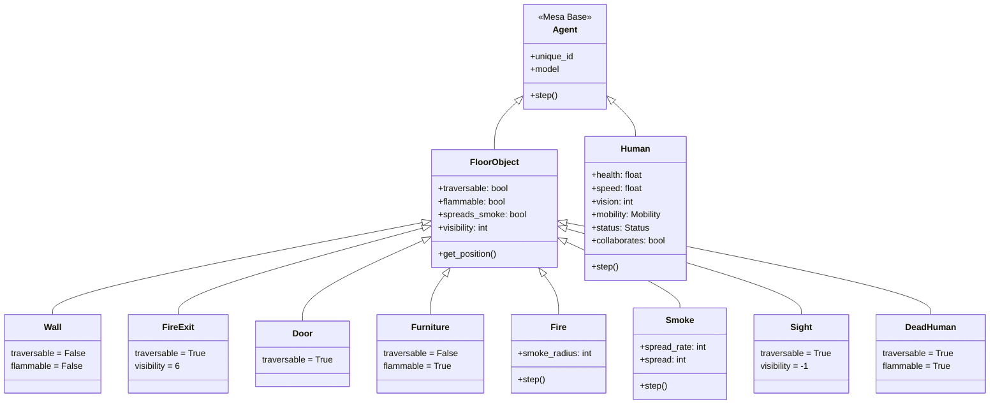

**Summary of agent types:**

| Agent | Symbol in .txt | Traversable | Flammable | Role |
|---|---|---|---|---|
| `Wall` | `W` | ❌ | ❌ | Boundary / room divider |
| `FireExit` | `E` | ✅ | ❌ | Escape point (high visibility=6) |
| `Door` | `D` | ✅ | ❌ | Room connector |
| `Furniture` | `F` | ❌ | ✅ | Fire spread source |
| `Fire` | _(spawned)_ | ❌ | ❌ | Spreads to flammable neighbours |
| `Smoke` | _(spawned)_ | ✅ | ❌ | Reduces health, impairs visibility |
| `DeadHuman` | _(spawned)_ | ✅ | ✅ | Left behind when a human dies; causes shock |
| `Sight` | _(spawned)_ | ✅ | ❌ | Visual marker for agent vision cone |
| `Human` | _(spawned)_ | ❌\* | ✅ | The main evacuating agent |

> \* Humans are not traversable but can be displaced/pushed by other agents.

---

### 3.3 Human Agent Behaviour

**File:** `backend/fire_evacuation/agent.py` — `class Human`

The `Human` agent is the most complex component. Each agent has its own individual attributes and executes a multi-step decision cycle every simulation tick.

#### Human Attributes

| Attribute | Range | Description |
|---|---|---|
| `health` | 0.75 – 1.0 | Decreases near fire/smoke. Death at 0. |
| `speed` | 1 – 2 | Steps per tick. Slows with health loss. |
| `vision` | 1 – grid_size | Field-of-view radius. Based on WHO distribution. |
| `nervousness` | 1 – 10 | Amplifies panic response. |
| `experience` | 1 – 10 | Reduces panic score. |
| `believes_alarm` | `bool` | 90% start believing; others convert when shocked. |
| `collaborates` | `bool` | Determined by `collaboration_percentage`. |
| `shock` | 0 – 1.0 | Increases near fire, smoke, dead humans. |
| `knowledge` | 0 – 1.0 | Fraction of grid the agent has "mapped". |

#### Agent Step Cycle

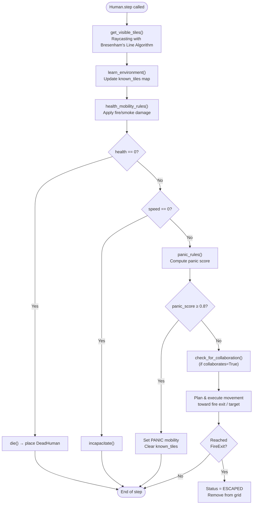

#### Panic Score Formula

```
panic_score = (health_component + experience_component + shock) / 3

where:
  health_component     = 1 / exp(health / nervousness)
  experience_component = 1 / exp(experience / nervousness)
```

A panic score ≥ **0.8** triggers PANIC state, causing the agent to forget all known tiles and move erratically.

#### Mobility States

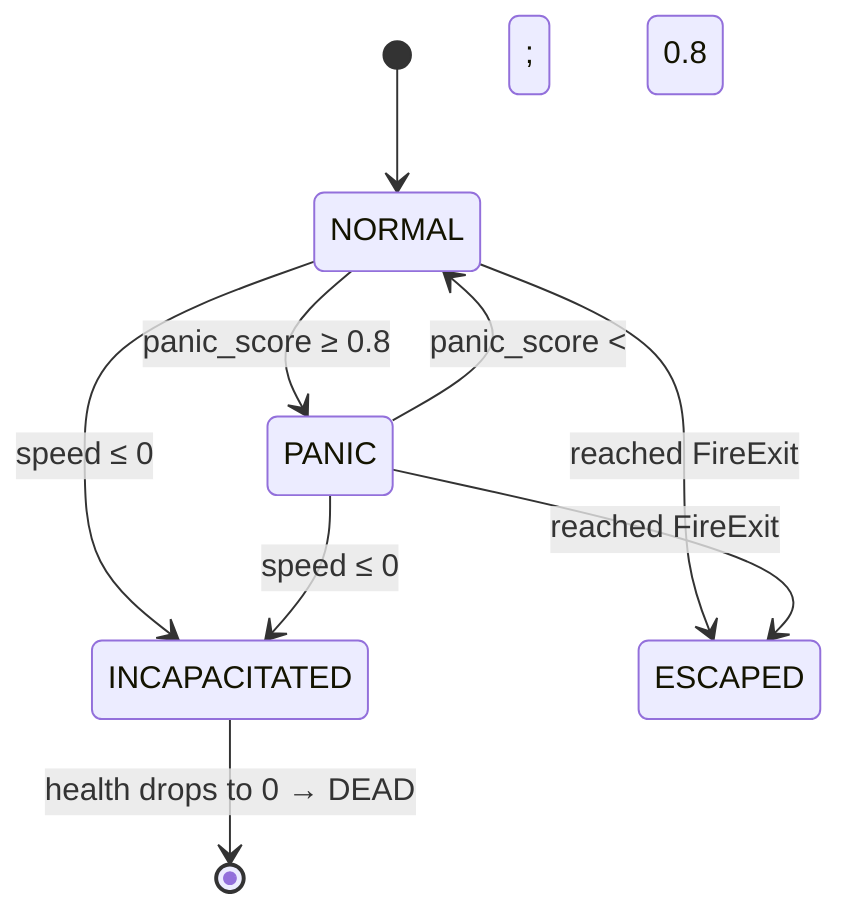

#### Status States

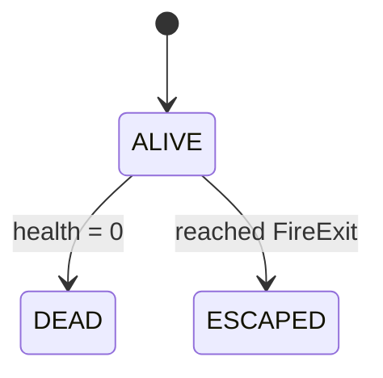

#### Collaboration Types

When an agent has `collaborates=True` and passes a probabilistic `test_collaboration()` check, it can perform one of three actions:

| Type | Trigger | Action |
|---|---|---|
| **Verbal Support** | Agent sees a FireExit | Broadcasts exit location to all visible normal agents |
| **Physical Support** | Agent sees an INCAPACITATED human | Moves to them and carries them toward exit |
| **Morale Support** | Agent sees a PANICKING human | Moves to them and reduces their panic (morale_boost) |

The **collaboration cost** (probability against collaborating) increases the more the agent has already collaborated and the higher their current panic score — modelling exhaustion and self-preservation instincts.

---

### 3.4 Fire & Smoke Propagation

#### Fire Spread

Each `Fire` agent steps every tick and checks its Moore neighbourhood (cross shape, non-diagonal):

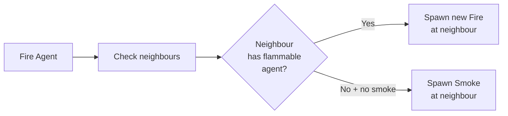

- Fire spreads to any neighbour that contains a **flammable** agent (Furniture, Human, DeadHuman).
- Smoke is emitted to any connected cell that `spreads_smoke=True`.

#### Smoke Spread

`Smoke` agents spread to their neighbours with a configurable `spread_rate`. They reduce the **visibility** of agents passing through them (stacking smoke count reduces what objects can be seen through the path). Smoke also:
- Reduces agent **health** by `0.005` per step.
- Reduces agent **speed** when health drops below 50%.

---

### 3.5 Floorplan System

Floorplans are defined as **ASCII text files** in `backend/fire_evacuation/floorplans/`.

**Symbol key:**

| Symbol | Meaning |
|---|---|
| `W` | Wall |
| `E` | Fire Exit |
| `F` | Furniture (flammable) |
| `D` | Door |
| `S` | Spawn Point (for humans if `random_spawn=False`) |
| `_` | Empty traversable floor |

**Example excerpt of `floorplan_testing.txt`:**
```
W W W W W W W W W W W W W W W W W W W W W W W W E E W W W ...
W F F _ _ _ _ _ _ _ _ _ _ _ _ _ _ _ _ F F W _ _ _ _ _ _ W ...
W _ _ _ _ _ _ _ _ _ _ _ _ _ _ _ _ _ _ _ _ W _ _ _ _ _ _ W ...
W _ _ _ _ _ _ _ _ _ _ _ _ _ _ _ _ _ _ _ _ D _ _ _ _ _ _ D ...
W W W W W W W W W W W W W W W W W W W W W W W W W W W W W ...
```

This is a 50×50 grid representing a two-wing building with:
- Walls enclosing the perimeter and separating wings.
- Furniture clusters near corners.
- Doors (`D`) connecting wings at mid-height.
- A fire exit (`E`) at the top of the central corridor.

Available floorplans:

| File | Description |
|---|---|
| `floorplan_testing.txt` | Standard two-wing test building |
| `floorplan_1.txt` | Alternate layout 1 |
| `floorplan_2.txt` | Alternate layout 2 |
| `floorplan_blank.txt` | Open floor, no internal walls |

---

## 4. Backend — API Layer

**File:** `backend/api.py`

The API is built with **FastAPI** and exposes two endpoints:

### REST Endpoint

```
GET /api/floorplans
```
Returns the list of available `.txt` floorplan filenames from the `fire_evacuation/floorplans/` directory.

**Response:**
```json
{
  "floorplans": ["floorplan_testing.txt", "floorplan_1.txt", "floorplan_2.txt", "floorplan_blank.txt"]
}
```

### WebSocket Endpoint

```
WS /ws
```

This is the primary communication channel. A single persistent WebSocket per browser session drives the whole simulation.

#### Commands (Frontend → Backend)

| Command | Payload | Action |
|---|---|---|
| `init` | `{ params: { human_count, ... } }` | Creates a new `FireEvacuation` model and sends initial state |
| `step` | _(none)_ | Advances simulation by one step |
| `play` | _(none)_ | Starts the automatic simulation loop (10 steps/sec) |
| `pause` | _(none)_ | Stops the automatic loop |

#### State Updates (Backend → Frontend)

Every time the model advances, the server serialises and sends the full grid state:

```json
{
  "step": 42,
  "running": true,
  "fire_started": true,
  "agents": [
    { "id": "5", "x": 12, "y": 8, "type": "Human", "mobility": 1, "is_carrying": false },
    { "id": "7", "x": 3, "y": 3, "type": "Fire" }
  ],
  "stats": {
    "alive": 8, "dead": 1, "escaped": 1,
    "normal": 6, "panic": 2, "incapacitated": 0,
    "verbal_collaboration": 3, "physical_collaboration": 1, "morale_collaboration": 0
  }
}
```

#### Simulation Loop Architecture

```mermaid
sequenceDiagram
    participant FE as Frontend
    participant WS as WebSocket Handler
    participant Loop as simulation_loop (asyncio task)
    participant Model as FireEvacuation Model

    FE->>WS: {"command": "init", "params": {...}}
    WS->>Model: FireEvacuation(**params)
    WS-->>FE: Initial grid state (step 0)

    FE->>WS: {"command": "play"}
    WS->>Loop: is_playing = True

    loop Every 100ms (10 steps/sec)
        Loop->>Model: model.step()
        Loop-->>FE: Updated grid state (JSON)
    end

    FE->>WS: {"command": "pause"}
    WS->>Loop: is_playing = False

    FE->>WS: {"command": "step"}
    WS->>Model: model.step()
    WS-->>FE: Updated grid state (JSON)
```

---

## 5. Frontend — Web Dashboard

The frontend is a **Next.js 14+ (App Router)** application written in **TypeScript** with **Tailwind CSS** for styling and **Recharts** for live charts.

### 5.1 UI Layout

The dashboard is a **three-panel layout** filling the full screen:

```
┌─────────────────────────────────────────────────────────────────────────┐
│  🔥 Fire Evacuation Dashboard          Agent-Based Model • Step 42      │
│  [Header Bar]                                        [🔥 FIRE ACTIVE]   │
├──────────────────┬──────────────────────────────┬───────────────────────┤
│                  │                              │                       │
│  LEFT PANEL      │     CENTER PANEL             │   RIGHT PANEL         │
│  (340px)         │     (flex-1, fills space)    │   (500px)             │
│                  │                              │                       │
│  ┌────────────┐  │  ┌────────────────────────┐  │  ┌─────────────────┐  │
│  │ Parameters │  │  │                        │  │  │  Human Status   │  │
│  │ • Floorplan│  │  │   SimulationGrid.tsx   │  │  │  (Line Chart)   │  │
│  │ • Humans   │  │  │                        │  │  ├─────────────────┤  │
│  │ • Collab % │  │  │  Pixel-perfect canvas  │  │  │  Human Mobility │  │
│  │ • Fire prob│  │  │  rendering all agents  │  │  │  (Line Chart)   │  │
│  │ • Checkboxes│ │  │  as layered images     │  │  ├─────────────────┤  │
│  └────────────┘  │  │                        │  │  │  Collaboration  │  │
│  ┌────────────┐  │  └────────────────────────┘  │  │  (Line Chart)   │  │
│  │   Init     │  │                              │  └─────────────────┘  │
│  │  [Step]    │  │                              │                       │
│  │  [Play]    │  │                              │                       │
│  └────────────┘  │                              │                       │
│  ┌────────────┐  │                              │                       │
│  │Live Stats  │  │                              │                       │
│  │Alive/Dead/ │  │                              │                       │
│  │Escaped cols│  │                              │                       │
│  └────────────┘  │                              │                       │
└──────────────────┴──────────────────────────────┴───────────────────────┘
```

---

### 5.2 Component Breakdown

#### `page.tsx` — Root Layout

Orchestrates the full layout. Pulls state from `useSimulation()` hook and passes props down to all panels.

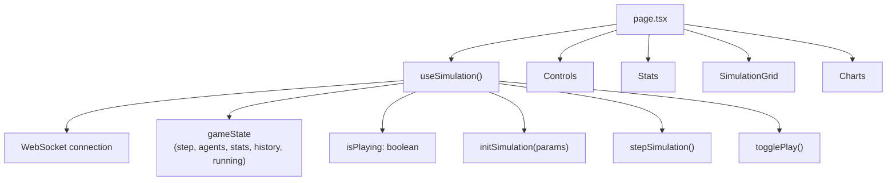

---

#### `SimulationGrid.tsx` — Visual Canvas

Renders all agents as **percentage-based positioned `<Image>` elements** inside a `relative` div container. This approach scales the grid to any resolution without a `<canvas>` element.

**Key logic:**
- Grid dimensions come from `gameState.grid_width` and `grid_height`.
- Each cell is `(1/grid_width)*100`% wide and `(1/grid_height)*100`% tall.
- **Y-axis flip:** Mesa's coordinate origin is bottom-left; CSS is top-left. Corrected by: `topPct = ((grid_height - 1 - agent.y) / grid_height) * 100`.
- Layering is controlled by `zIndex` values so agents render in correct depth order.

**Z-index layer order:**

| Z | Agents |
|---|---|
| 1 | Wall, FireExit, Door, Furniture |
| 2 | Smoke |
| 3 | Fire |
| 4 | DeadHuman |
| 5 | Human |
| 7 | Sight (vision overlay) |

**Visual icons (from `/public/resources/`):**

| Agent State | Image |
|---|---|
| Normal Human | `human.png` |
| Panicking Human | `panicked_human.png` |
| Incapacitated Human | `incapacitated_human.png` |
| Carrying Human | `carrying_human.png` |
| Dead Human | `dead.png` |
| Fire | `fire.png` |
| Smoke | `smoke.png` |
| Fire Exit | `fire_exit.png` |
| Door | `door.png` |
| Wall | `wall.png` |
| Furniture | `furniture.png` |
| Vision Sight | `eye.png` |

---

#### `Controls.tsx` — Parameter Panel

- Fetches available floorplans from `GET /api/floorplans` on mount.
- Renders sliders for `human_count`, `collaboration_percentage`, and `fire_probability`.
- Renders checkboxes for `random_spawn` and `visualise_vision`.
- **Initialize Model** button sends the `init` command via WebSocket.
- **Step** button sends `step` command (disabled during auto-play).
- **Play/Pause** toggle button sends `play` or `pause` commands.

---

#### `Stats.tsx` — Live Statistics

Displays the current step's statistics as a **3-column card grid**:

- **Status row:** Alive (blue) · Dead (red) · Escaped (green)
- **Mobility row:** Normal (teal) · Panic (orange) · Incapacitated (purple)

---

#### `Charts.tsx` — Historical Line Charts

Uses **Recharts** with three `LineChart` components, each driven by `gameState.history` (an ever-growing array of `StatDataPoint` objects):

| Chart | Lines |
|---|---|
| Human Status | Alive · Dead · Escaped |
| Human Mobility | Normal · Panic · Incapacitated |
| Human Collaboration | Verbal · Physical · Morale |

The history array is **reset to `[]` on every new `init`** (when `step === 0`), so charts always reflect the current run.

---

### 5.3 WebSocket Hook

**File:** `frontend/src/hooks/useSimulation.ts`

Centralises all WebSocket communication and state management into a single reusable hook.

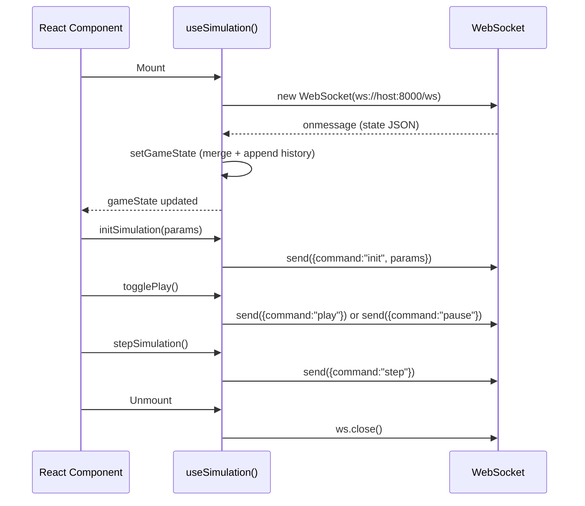

**State shape managed by the hook:**

```typescript
interface SimulationState {
  step: number;           // Current simulation step
  agents: Agent[];        // All agents on grid this tick
  stats: SimulationStats | null; // Current step counts
  history: StatDataPoint[]; // Historical data for charts
  running: boolean;       // Whether simulation is still active
  grid_width: number;
  grid_height: number;
  fire_started: boolean;  // Flag for "FIRE ACTIVE" UI banner
}
```

---

## 6. Data Flow

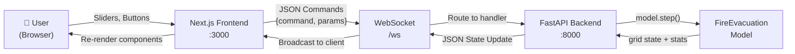

**Full lifecycle of one simulation run:**

1. **User opens browser** → `useSimulation` hook connects WebSocket.
2. **User fetches floorplans** → `Controls` does `GET /api/floorplans`.
3. **User configures and clicks "Initialize"** → `init` command sent over WebSocket.
4. Backend creates `FireEvacuation(**params)`, returns step-0 grid state.
5. **User clicks "Play"** → `play` command sent.
6. Backend's async `simulation_loop` task calls `model.step()` every 100ms.
7. Each step's full state JSON is broadcast to the frontend.
8. Frontend merges state → Re-renders `SimulationGrid`, `Stats`, and appends `Charts` history.
9. Simulation ends when all humans are dead or escaped → `running: false` → auto-pause.

---

## 7. Key Algorithms

### 7.1 Bresenham's Line Algorithm (Raycasting)

Used in `get_visible_tiles()` to determine what each human agent can *see* from their position. For every tile in the agent's neighbourhood radius:
- A line is traced from the agent's position to the target tile.
- Each tile along the line is checked: if a `Wall` is hit, the rest of that path is blocked.
- `Smoke` tiles increment a counter, reducing the effective visibility of objects further along the path.
- The result is an accurate, smoke-aware field-of-view.

```python
@lru_cache(maxsize=100000)
def get_line(start, end):
    # Bresenham's Line Algorithm → returns list of (x,y) coords
```

> The `@lru_cache` decorator caches computed paths for massive performance gains since many agents calculate overlapping paths.

### 7.2 Shortest Path (NetworkX)

When a human has a known target (exit, door, or collaboration target), they use `nx.shortest_path(graph, self.pos, target)` to find the optimal route. The graph is pre-built at model initialisation from all traversable tiles.

### 7.3 Probabilistic Agent Attributes

Agent personalities are sampled from real-world distributions:

- **Vision:** Sampled from `[0.0058, 0.0365, 0.0424, 0.9153]` distribution (sourced from WHO global visual impairment data). Most agents have high vision; a small fraction have impaired vision.
- **Nervousness:** Weighted distribution favouring higher nervousness values (more agents above median).
- **Alarm Belief:** 90% of agents start believing the alarm is real; 10% require visible evidence (fire/smoke/dead humans) to start evacuating.

---

## 8. Simulation Parameters

| Parameter | Slider Range | Effect |
|---|---|---|
| `human_count` | 1 – 100 | Total number of occupants to simulate |
| `collaboration_percentage` | 0 – 100% (step 10) | Proportion of agents that will attempt to help others |
| `fire_probability` | 0.0 – 1.0 | Each step without fire, this is the chance it starts |
| `random_spawn` | Toggle | If OFF, agents spawn only at defined `S` tiles |
| `visualise_vision` | Toggle | Overlays each agent's real-time vision cone on the grid |

---

## 9. Statistics & Metrics

The simulation tracks and visualises three categories of statistics in real time:

### Status Counters
| Metric | Meaning |
|---|---|
| `alive` | Agents currently on the grid (not escaped or dead) |
| `dead` | Agents whose health reached zero |
| `escaped` | Agents who successfully reached a `FireExit` |

### Mobility Counters
| Metric | Meaning |
|---|---|
| `normal` | Agents with calm, directed movement |
| `panic` | Agents exceeding the 0.8 panic threshold |
| `incapacitated` | Agents whose speed reached zero (can be carried) |

### Collaboration Counters (cumulative)
| Metric | Meaning |
|---|---|
| `verbal_collaboration` | Total times an agent broadcast exit knowledge to others |
| `physical_collaboration` | Total times an agent carried an incapacitated human |
| `morale_collaboration` | Total times an agent calmed a panicking human |

---

## 10. Technology Stack Summary

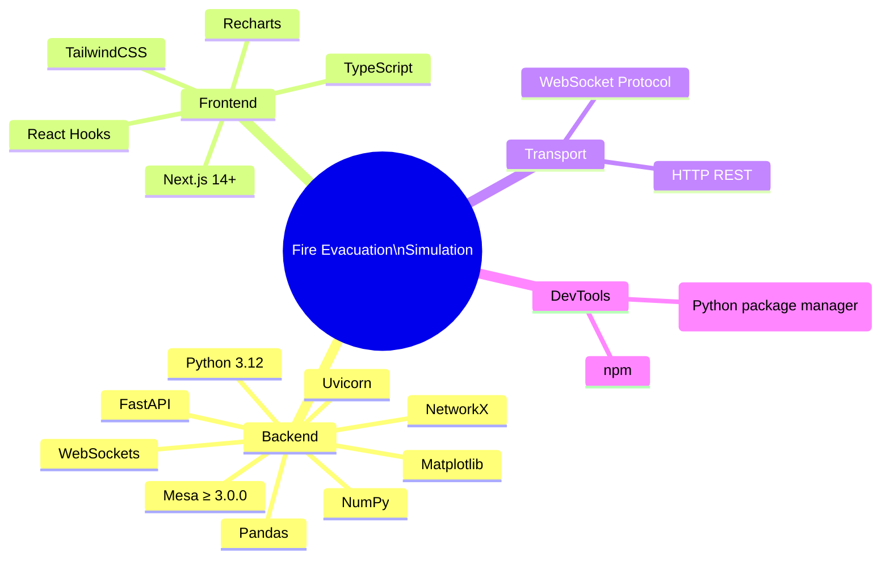

| Category | Technology | Version / Notes |
|---|---|---|
| **Simulation Framework** | [Mesa](https://mesa.readthedocs.io/) | ≥ 3.0.0 |
| **Backend API** | FastAPI + Uvicorn | Async, ASGI |
| **Pathfinding** | NetworkX | Graph shortest-path |
| **Numerical Grid** | NumPy | Matrix operations |
| **Frontend Framework** | Next.js (App Router) | TypeScript |
| **Charting** | Recharts | React-native charts |
| **Styling** | Tailwind CSS | Utility-first |
| **Package Manager (Python)** | uv | Fast pip replacement |
| **Package Manager (JS)** | npm | Standard |
| **Real-time Transport** | WebSocket | Persistent, full-duplex |

---

## 11. Setup & Running

### Prerequisites
- Python 3.12
- Node.js ≥ 18
- `uv` installed (`pip install uv`)

### Backend

```bash
# Navigate to backend
cd backend

# Create virtual environment
uv venv --python 3.12

# Activate virtual environment
source venv/bin/activate         # macOS / Linux
venv\Scripts\activate            # Windows

# Install dependencies
uv pip install -r requirements.txt

# Start the FastAPI server
uv run uvicorn api:app --host 0.0.0.0 --port 8000
```

### Frontend

```bash
# In a new terminal, navigate to frontend
cd frontend

# Install dependencies (first run only)
npm install

# Start development server
npm run dev
```

Open **http://localhost:3000** in your browser.

> **Network Access:** Because the server is bound to `0.0.0.0`, other devices on the same network can access it using the host machine's IP address (e.g., `http://192.168.1.x:3000`). The WebSocket URL is dynamically constructed from `window.location.hostname` so it resolves correctly for any client.

### Project Structure

```
application/
├── backend/
│   ├── api.py                      # FastAPI server + WebSocket handler
│   ├── requirements.txt            # Python dependencies
│   ├── fire_evacuation/
│   │   ├── model.py                # FireEvacuation Mesa Model
│   │   ├── agent.py                # All agent classes (Human, Fire, Smoke, ...)
│   │   ├── utils.py                # Utility helpers
│   │   └── floorplans/             # ASCII floorplan .txt files
│   │       ├── floorplan_testing.txt
│   │       ├── floorplan_1.txt
│   │       ├── floorplan_2.txt
│   │       └── floorplan_blank.txt
│   └── test_ws.py                  # WebSocket connection tests
├── frontend/
│   ├── src/
│   │   ├── app/
│   │   │   ├── page.tsx            # Root page (3-panel layout)
│   │   │   ├── layout.tsx          # Next.js root layout
│   │   │   └── globals.css         # Global styles
│   │   ├── components/
│   │   │   ├── SimulationGrid.tsx  # Agent grid renderer
│   │   │   ├── Controls.tsx        # Parameter controls + action buttons
│   │   │   ├── Stats.tsx           # Live numeric stats cards
│   │   │   └── Charts.tsx          # Recharts historical line charts
│   │   ├── hooks/
│   │   │   └── useSimulation.ts    # WebSocket state management hook
│   │   └── types/
│   │       └── index.ts            # TypeScript interfaces
│   ├── public/
│   │   └── resources/              # Agent icon images
│   └── package.json
└── readme.md
```

---

*Report generated: March 2026*
